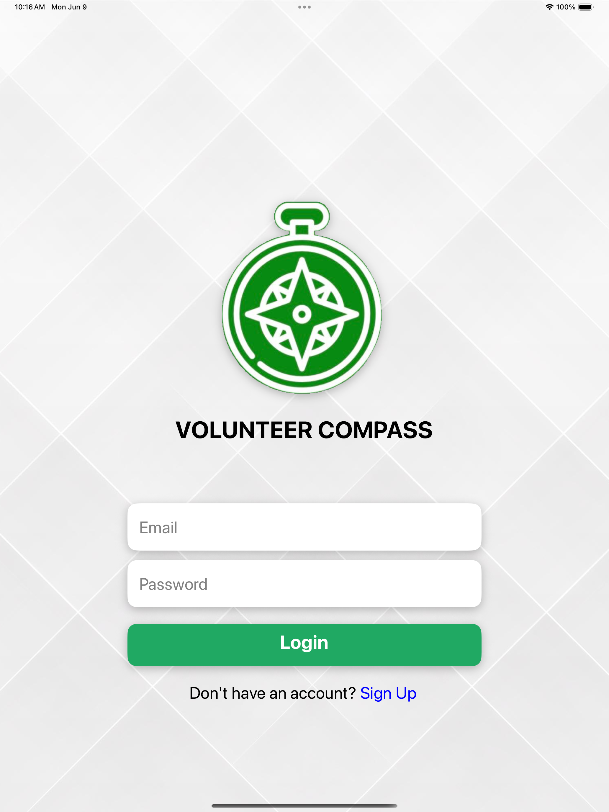

# VolunteerCompass

## Overview

VolunteerCompass is a mobile platform that connects volunteers with NGOs and their events. The app makes it easy for users to discover, join, and manage volunteering opportunities in their city or area of interest.

## Use Case

VolunteerCompass is designed for individuals who want to make a positive impact by volunteering for social causes. NGOs can list their events, and volunteers can browse, search, and participate in these events. The app streamlines the process of finding and joining volunteering opportunities, making community engagement more accessible and organized.

## Key Features

- **Browse NGOs and Events:** Explore NGOs and their events by city or category (e.g., Education, Animal Shelter, Elderly Care, Health Care).
- **Search Functionality:** Search for NGOs and events based on keywords and location.
- **Event Management:** Volunteers can view and manage the events they have joined. NGOs can manage their own events.
- **NGO Profiles:** View detailed information about NGOs, including descriptions, contact info, and locations.
- **User Authentication:** Sign up and log in to access personalized features.
- **Blog Section:** Read blogs related to volunteering and social impact.

## Getting Started

1. **Install dependencies:**
   ```bash
   npm install
   # or
   yarn install
   ```
2. **Start the app:**
   ```bash
   npm start
   # or
   yarn start
   ```
3. **Run on your device:**
   - For iOS: `npm run ios`
   - For Android: `npm run android`

## Tech Stack

- React Native
- Expo
- Various React Native libraries for navigation, storage, and UI

## Screenshot
Preview of the app UI.

<p align="center">
  
</p>

---

For more details, explore the codebase or contact the maintainers.
